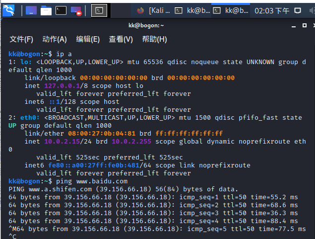
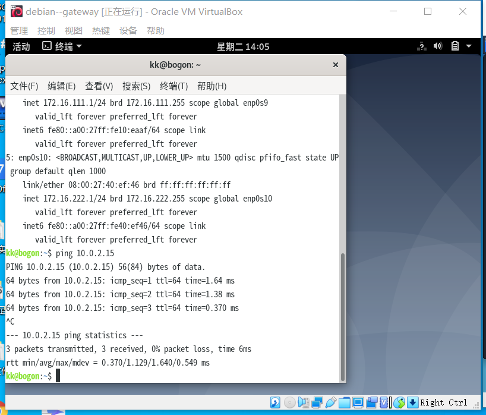

# 实验一：基于 VirtualBox 的网络攻防基础环境搭建

### 实验目的

- [x] 掌握 VirtualBox 虚拟机的安装与使用
- [x] 掌握 VirtualBox 的虚拟网络类型和按需配置
- [x] 掌握 VirtualBox 的虚拟硬盘多重加载


### 实验环境
+ 虚拟机：VirtualBox
+ 攻击者主机：Kali
+ 网关：Debian
+ 靶机：Windows-xp x2，Kali x1，Debian x1
  
|   虚拟机名称   |      网卡选择      |                       IP地址                        |
| :------------: | :----------------: | :-------------------------------------------------: |
| gateway-debian |  NAT网络   |                     10.0.2.4/24                   |
|                |   Host-Only网络    |                  192.168.56.106/24                  |
|                | 内部网络，intnet-1 |                  172.16.111.1/24                   |
|                | 内部网络，intnet2  |                   172.16.222.1/24                 |
|  victim-xp-1   | 内部网络，intnet-1 | 172.16.111.101  |
|  victim-kali   | 内部网络，intnet-1 | 172.16.111.108 |
|  victim-xp-2   | 内部网络，intnet-2 | 172.16.222.117  |
| victim-debian  | 内部网络，intnet-2 | 172.16.222.142 |
| attacker-kali  |  NAT网络   |            10.0.2.15/24                     |
  

### 实验过程及结果
##### step1.下载各虚拟机镜像，创建虚拟机，并将虚拟硬盘配置成多重加载

##### step2.为各虚拟机修改网卡连接方式
###### 配置网络
网关机
+ 前两块网卡设置为NAT网络、Host-Only模式
+ 后两块内网连接的两块网卡手动设置：
  编辑/etc/network/interfaces,增加如下内容

```
# /etc/network/interfaces
# This file describes the network interfaces available on your system
# and how to activate them. For more information, see interfaces(5).

source /etc/network/interfaces.d/*

# The loopback network interface
auto lo
iface lo inet loopback

# The primary network interface
allow-hotplug enp0s3
iface enp0s3 inet dhcp
  post-up iptables -t nat -A POSTROUTING -s 172.16.111.0/24 ! -d 172.16.0.0/16 -o enp0s3 -j MASQUERADE
  post-up iptables -t nat -A POSTROUTING -s 172.16.222.0/24 ! -d 172.16.0.0/16 -o enp0s3 -j MASQUERADE

  # demo for DNAT
  post-up iptables -t nat -A PREROUTING -p tcp -d 192.168.56.113 --dport 80 -j DNAT --to-destination 172.16.111.118
  post-up iptables -A FORWARD -p tcp -d '172.16.111.118' --dport 80 -j ACCEPT
  
  post-up iptables -P FORWARD DROP
  post-up iptables -A FORWARD -m state --state RELATED,ESTABLISHED -j ACCEPT
  post-up iptables -A FORWARD -s '172.16.111.0/24' ! -d '172.16.0.0/16' -j ACCEPT
  post-up iptables -A FORWARD -s '172.16.222.0/24' ! -d '172.16.0.0/16' -j ACCEPT
  post-up iptables -I INPUT -s 172.16.111.0/24 -d 172.16.222.0/24 -j DROP
  post-up iptables -I INPUT -s 172.16.222.0/24 -d 172.16.111.0/24 -j DROP
  post-up echo 1 > /proc/sys/net/ipv4/ip_forward
  post-down echo 0 > /proc/sys/net/ipv4/ip_forward
  post-down iptables -t nat -F
  post-down iptables -F
allow-hotplug enp0s8
iface enp0s8 inet dhcp
allow-hotplug enp0s9
iface enp0s9 inet static
  address 172.16.111.1
  netmask 255.255.255.0
allow-hotplug enp0s10
iface enp0s10 inet static
  address 172.16.222.1
  netmask 255.255.255.0
```
  + 重启网络生效  
	`systemctl restart networking`

+ 至此四个网卡IP地址分别为：
   
   
   

此时通过follow视频里老师手动分配victim-xp-1虚拟机ip地址能够实现单向联通，关闭防火墙可以实现双向联通：
   
   
   

+ 安装dnsmasq服务器以及vim编辑器
   
      ```
      sudo apt-get update 
      sudo apt install dnsmasq
      sudo apt install vim
      ```
+ 停止dnsmasq服务   
    `/etc/init.d/dnsmasq stop`
+ 进入/etc/dnsmasq.d目录执行以下命令以添加.conf文件  
    `sudo vi gw-enp0s9.conf`
     
     ```
     # /etc/dnsmasq.d/gw-enp09.conf
    interface=enp0s9
    dhcp-range=172.16.111.100,172.16.111.150,240h
     ```
  
    `sudo vi gw-enp0s10.conf`
     ```
     # /etc/dnsmasq.d/gw-enp010.conf
    interface=enp0s10
    dhcp-range=172.16.222.100,172.16.222.150,240h
     ```
+ 备份配置文件
      ```
      cp dnsmasq.conf dnsmasq.conf.bak
      ```
+ 编辑dnsmasq.conf配置文件
  ```
        < log-queries
        < log-facility=/var/log/dnsmasq.log

        > #log-queries
        < log-dhcp
        > #log-dhcp
  ```
+ 重启服务及设为自启动服务：  
    `systemctl restart dnsmasq`
    `systemctl enable dnsmasq`
     


靶机
+ Victim-kali设为内部网络，intnet-1 

+ Victim-xp-1设为内部网络，intnet-1 

+ Victim-debian设为内部网络，intnet-2

+ Victim-xp-2设为内部网络，intnet-2

攻击者主机设置为NAT网络模式


### 实验搭载成果测试
+ 网络连通性测试
	+  靶机可以直接访问攻击者主机
	
	+ 攻击者主机无法直接访问靶机
	
	+ 网关可以直接访问攻击者主机和靶机
		
        
	+ 靶机的所有对外上下行流量必须经过网关      
	靶机访问互联网后，查看网关上的dnsmasq日志
    
	+ 所有节点均可以访问互联网   
   
    (共享粘贴板没设置成功，用的微信网页版粘贴的代码，笨人有笨人的方法==)   

### 实验问题及反馈
+ 安装kali提醒部分软件安装失败n次后终于发现了原因：内存分配太小了！淦，后悔没听黄大的话！
+ 刚开始攻击者和网关的NAT为自动选择的“网络地址转换NAT”而不是“NAT网络”，直到写实验报告才发现地址不对劲，做实验还是要更仔细一点！
+ vi编辑器也太不好用了吧，上下左右键盘转为abcd,还没有删除键，忍不住安装了vim！
+ Debian装了图形界面发现里面小游戏还挺多，突然觉得几个小时的安装过程值了~


### 实验参考
+ [往期作业](https://github.com/CUCCS/2019-NS-Public-chencwx/blob/ns_chap0x01)
+ [黄药师教学视频](https://b23.tv/Dzvdxb)