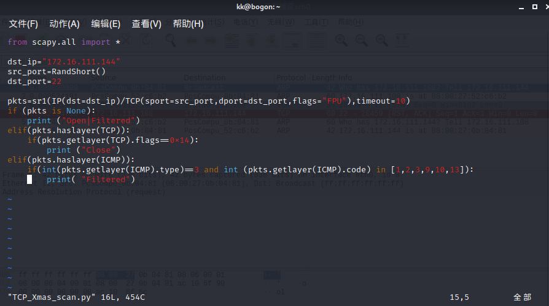
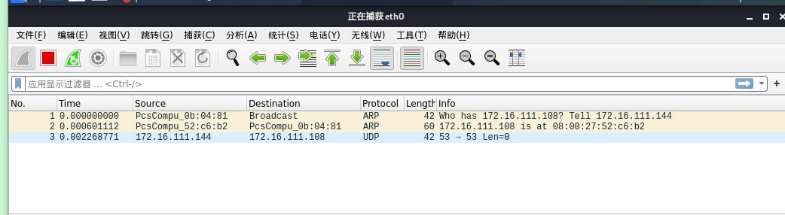

## 实验五：基于 Scapy 编写端口扫描器

### 实验目的

掌握网络扫描之端口状态探测的基本原理

### 实验环境

* scapy+python

* nmap

* Vitrualbox实验网络拓扑图
  (测试主机IP地址172.16.111.108)
  

### 实验要求
 + [x] 禁止探测互联网上的 IP ，严格遵守网络安全相关法律法规
+ [x] 完成以下扫描技术的编程实现
	+ TCP connect scan,TCP stealth scan
	+ TCP Xmas scan 
	+ UDP scan

+ [x] 上述每种扫描技术的实现测试均需要测试端口状态为：开放、关闭 和 过滤 状态时的程序执行结果
+ [x] 提供每一次扫描测试的抓包结果并分析与课本中的扫描方法原理是否相符？如果不同，试分析原因；
+ [x] 在实验报告中详细说明实验网络环境拓扑、被测试 IP 的端口状态是如何模拟的

### 知识预备
* ufw命令：`sudo ufw enable\disable`; `sudo ufw allow port-num` 
* 检测某一端口状态：`sudo netstat -lnp | grep port-num`
* 设置端口过滤状态：`sudo ufw deny port-num`
* nmap扫描TCP：`sudo nmap [-sT/sX/sS] ip-address`; 扫描UDP：`sudo namp -sU ip-address`

### 实验过程
#### 环境准备（本实验以端口`22/tcp，53/udp`为实验端口）
* 在`kali-victim`中安装`ufw`，用于控制端口打开、关闭以及过滤：`sudo apt install ufw`
* 在`kali-victim`中安装`dnsmasq`，用于搭建dns服务：`sudo apt install dnsmasq`
* 在`kali-victim`中运行`sudo service ssh start/stop`控制22/tcp端口开关 `sudo service dnsmasq start/stop`控制53/udp端口开关

**TCP connect scan**
+ 原理       
  基于最基本的 TCP 三次握手链接建立机制，攻击主机发送一个 SYN 数据包到目标主机的特定端口上，端口各状态下接受包的情况为：
  + 端口开启：目标机接受该次连接并返回一个带有 SYN/ACK 标识的数据包给攻击端，随后攻击端返回一个 ACK 确认包，此时两端建立了连接，完成了一次三次握手，那么目标端对应的端口就是开放的
  + 端口关闭：目标主机返回一个RST/ACK数据包，说明端口处于关闭状态
  + 端口过滤状态：目标主机没有任何响应则意味着目标主机的端口处于过滤状态
+ 实验.py脚本
  

+ 不同端口状态与抓包结果
  
  **open**
   

   **close**
    

    **filtered**
     

_--->抓包结果并分析与课本中的扫描方法原理相符_
  
**TCP stealth/SYN scan**
+ 原理     
  TCP SYN 扫描并不需要打开一个完整的链接。发送一个 SYN 包启动三方握手链接机制，并等待响应，端口各状态下接受包的情况为：
  + 端口开启：目标机返回到一个 SYN/ACK 包表示目标端口是开放的，此时与TCP connect扫描不同，攻击端发送一个 RST 包立即拆除连接
  + 端口关闭：目标主机返回一个RST/ACK数据包，说明端口处于关闭状态
  + 端口过滤状态：目标主机没有任何响应则意味着目标主机的端口处于过滤状态
+ 实验.py脚本
  

+ 不同端口状态与抓包结果
  
  **open**
   

   **close**
    

    **filtered**
     

_--->抓包结果并分析与课本中的扫描方法原理相符_

**TCP Xmas scan**
+ 原理     
  攻击端发送一个 TCP 包，并对 TCP 报文头 FIN、URG 和 PUSH 标记进行设置，端口各状态下接受包的情况为：
  + 端口关闭：目标机响应 RST 报文，则表示端口为关闭状态
  + 端口开启或过滤状态：目标主机没有任何响应
+ 实验.py脚本
  

+ 不同端口状态与抓包结果
  
  **open/filtered** 

   **close** 

_--->抓包结果并分析与课本中的扫描方法原理相符_

**UDP scan**
+ 原理     
  UDP 是一个无链接的协议，攻击端向目标主机的 UDP 端口发送零字节的 UDP 数据包
  端口各状态下接受包的情况为：
  + 端口关闭：目标机返回一个 ICMP 不可到达(ICMP_PORT_UNREACHABLE)的错误，说明端口处于关闭状态
  + 端口开启或过滤状态：目标主机没有任何响应
+ 实验.py脚本
  

+ 不同端口状态与抓包结果
  
  **open/filtered** 

   **close** 

 _--->抓包结果并分析与课本中的扫描方法原理相符_

### 遇到的问题
+ 在扫描主机上执行`python TCP_connect_scan.py `会报错：`no module named scapy.all`
  
  解决方法:改用`python3 TCP_connect_scan.py`用python3.0以上版本运行.py脚本

+ 关于将某一端口设置为过滤状态时出现的问题：执行`sudo iptables -A INPUT -p tcp --dport 22 -j DROP`时无效，而`sudo ufw deny 22`可置为过滤状态
  
  个人推测`iptables`与`ufw`遵循不同的防火墙规则,不能混用

+ 在进行TCP_Xmax_scan时用`sudo nmap 172.16.111.108`22端口为`close`,而执行.py脚本时返回的确实`open|filtered`.
  
  解决方法：执行`sudo nmap -sX 172.16.111.108 -p 22`使用nmap-Xmasm秘密扫描确定要检测端口是否真正关闭，上述问题出现原因是普通nmap扫描的结果并不适用于TCP_Xmas_scan(做实验时没有仔细地去了解nmap的使用方法，踩雷了==)

    

### 参考资料

[ 往届作业 ](https://github.com/CUCCS/2019-NS-Public-hejueyun/pull/3/commits/ef7ae02e4345f0c5d06bd93c9fc137db80112d31 )

[ 线上课本 ](https://c4pr1c3.gitee.io/cuc-ns/chap0x05/main.html)

[ namp用法详解 ](https://blog.csdn.net/independe/article/details/96615598)

[ UFW防火墙配置命令 ](https://blog.csdn.net/qq_20336817/article/details/45059807) 

[ iptables防火墙配置命令 ](https://blog.csdn.net/zht666/article/details/17505789)

[ UFW与iptables ](https://blog.csdn.net/chonghu5376/article/details/100735233)