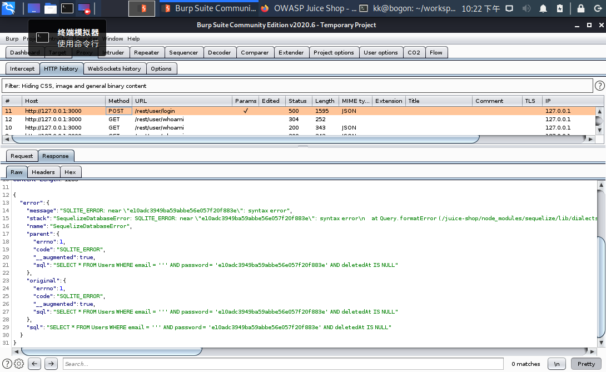

# 实验七 Part2：WEB应用漏洞攻防--Juice Shop

## 实验目的
+ 了解常见 Web 漏洞训练平台
+ 了解 常见 Web 漏洞的基本原理
+ 掌握 OWASP Top 10 及常见 Web 高危漏洞的漏洞检测、漏洞利用和漏洞修复方法

## 实验环境

* v-kali主机

* Juice Shop

## 实验要求
 
  + [x] 每个实验环境完成不少于 5 种不同漏洞类型的漏洞利用练习
  + [x] （可选）使用不同于官方教程中的漏洞利用方法完成目标漏洞利用练习
  + [x] （可选）最大化 漏洞利用效果实验
  + [x] （可选）定位缺陷代码

## Juice Shop环境准备

+ 更新及安装docker-ce
+ `sudo apt-get update && install docker-ce `
+ 在 /etc/apt/sources.list 中添加 Docker 官方的 apt 镜像源地址
`if [[ $(grep -c "docker.com" /etc/apt/sources.list) -eq 0 ]];then echo "deb https://download.docker.com/linux/debian buster stable" >> /etc/apt/sources.list;fi`
+ 添加 Docker 官方的 GPG 公钥到系统受信任公钥数据库
`curl -fsSL https://download.docker.com/linux/debian/gpg | sudo apt-key add -`
+ 切换到相应目录
`cd workspace/ctf-games/owasp/juice-shop`
+ 启动juice-shop系列服务
`cd docker-compose up -d`
+ 查看当前容器状态
`docker ps`

## 实验过程
****
### Find the carefully hidden 'Score Board' page 

**实验**

* goal：找到隐藏的计分板页面
* solution:点击网站的选项卡，注意观察url的格式变化，推测出score board访问的url后缀为`score-board`
* reflection:查看网络题解可以从源码中找到`score-board`的路径，可我怎么也没找到== Juice Shop原来真是shop啊~
  
  

*****
### Access a confidential document

**实验**

* goal：查阅机密文件
* solution: 在`about us`页面发现一个有趣的url,按F12审查元素，发现文件存储路径，访问该路径，就能发现并访问`acquisitions.md`机密文件啦~
* reflection:`Check out our boring terms of use if you are interested in such lame stuff`标题就很灵性~
  
  

****
###  Admin Section

**实验**
* goal：绕过登陆验证，以管理员身份登陆商店
* solution: 测试是否存在SQL注入，在用户名处输入`'`或`"`,密码处随便填写，然后login in小心试探，发现输入`'`时有异常反馈，由此判断存在漏洞。用burpsuit抓取一下服务器的返回，分析后端的报错信息。分析可知在用户名处输入`' or 1=1 --`即可使后端的SQL表达式变为`"SELECT * FROM Users WHERE email = '' or 1 =1 -- AND password = ...`,恒true.
`

****
###  Zero Stars

**实验**
* goal: 尝试提交零星评价
* solution: 点进`customer feedback`发现最低允许提交的评价为1星，用burpsuit拦截提交请求将`rating`项的值改为0即可。

****
###   Forgotten Developer Backup && Forgotten Sales Backup

**实验**
* goal: 访问`/ftp`路径下不被允许文件格式的备份文件`coupons_2013.md.bak`和`package.json.bak`
* solution: 通过加入后缀`%2500.md`用`%2500`暴力截断后缀名，绕过限制。

****

### Easter Egg

**实验**
* goal: 寻找复活节彩蛋
* solution:通过上一个实验发现在/ftp下有一个`eastere.gg`不知名文件，通过%2500,得到一段加密字符串：
  L2d1ci9xcmlmL25lci9mYi9zaGFhbC9ndXJsL3V2cS9uYS9ybmZncmUvcnR0L2p2Z3V2YS9ndXIvcm5mZ3JlL3J0dA==
  仔细观察字符串末尾的`==`明显的base64加密痕迹，故用base64解密得到：
  /gur/qrif/ner/fb/shaal/gurl/uvq/na/rnfgre/rtt/jvguva/gur/rnfgre/rtt
  访问无果，根据手动搜索网上题解得知需用ROT13解密（顺便学习了一下rot家族，跟凯撒加密有点像==），最后得到解码的原始字符串：
  /the/devs/are/so/funny/they/hid/an/easter/egg/within/the/easter/egg

* reflection：用ROT13解码也太难想了吧~~（蒟蒻内心os）
  
  
  
 

## 遇到的问题
* Firefox和burpsuite在webgoat设置的代理端口8080用于juice-shop总是提示已被占用？

解决：将Firefox和burpsuite的代理端口由`8080`改为`8111`，问题解决！

## 参考资料

[ 往届作业 ](https://github.com/CUCCS/2019-NS-Public-hejueyun/pull/4/commits/b207619d5d45b811794bf8f327dce612e09d89ff?short_path=b335630#diff-b335630551682c19a781afebcf4d07bf978fb1f8ac04c6bf87428ed5106870f5 )

[ 线上课本 ](https://c4pr1c3.gitee.io/cuc-ns/chap0x05/main.html)

[ WebGoat教程 ](https://www.cnblogs.com/wuweidong/p/8677431.html)

[Web常见漏洞描述及修复建议](https://www.cnblogs.com/iAmSoScArEd/p/10651947.html#auto_id_1)