# 实验七 Part1：WEB应用漏洞攻防--WebGoat

## 实验目的
+ 了解常见 Web 漏洞训练平台
+ 了解 常见 Web 漏洞的基本原理
+ 掌握 OWASP Top 10 及常见 Web 高危漏洞的漏洞检测、漏洞利用和漏洞修复方法

## 实验环境

* v-kali主机

* WebGoat-7.0.1


## 实验要求
 
  + [x] 每个实验环境完成不少于 5 种不同漏洞类型的漏洞利用练习
  + [x] （可选）使用不同于官方教程中的漏洞利用方法完成目标漏洞利用练习
  + [x] （可选）最大化 漏洞利用效果实验
  + [x] （可选）定位缺陷代码
  + [x] （可选）尝试从源代码层面修复漏洞

## WebGoat环境准备
+ 安装docker与docker-compose
`apt-get update && apt get install docker.io python3-pip `
`pip3 install docker-compose`
+ 新建工作目录
`mkdir workspace`
+ 开启docker服务
`systemctl start docker`
+ 切换至工作目录
`cd workspace/`
+ 下载课程所需漏洞练习环境并切换到相应目录下
`git clone https://github.com/c4pr1c3/ctf-games.git --recursive`
`cd ctf-games/`
+ 单独更新子模块
`git submodule init && git submodule update`
+ 启动 webgoat 系列服务
`cd owasp/webgoat/ && docker-compose up -d`
+ 查看当前容器状态是否healthyn
`docker ps`

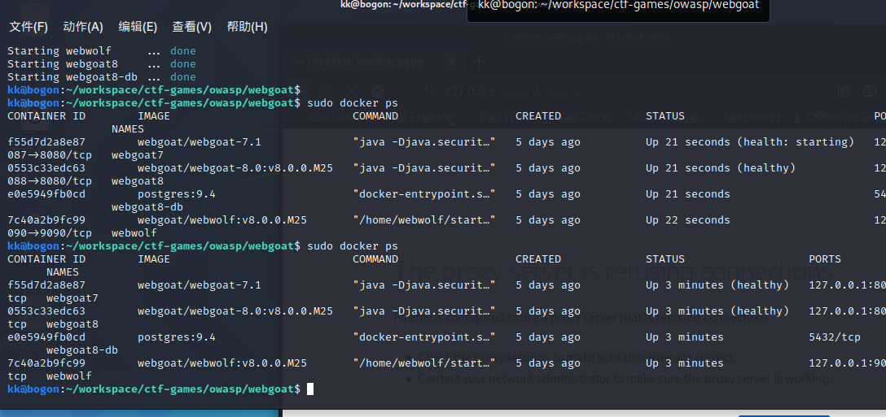
## 实验过程
****
###  Authentication Flaws 认证缺陷
**1-->Forgot Password**

**实验**

* goal：尝试通过回答问题登陆管理员`admin`的账号
* solution:暴力枚举，得到管理员最喜欢的颜色是`green`

  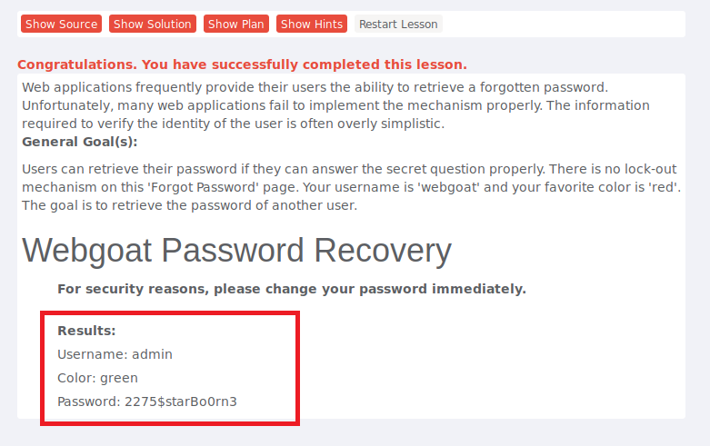

**防御修复**
* 设置问题的答案可能样本库要够大或设置多个问题
* 答非所问（自己经常这样做~）
  

**2-->Multi Level Login2**

**实验**

* goal：已知Joe的身份(Joe有一个有效的webgoat金融账户)，作为Jane登录。
* solution: 在第二次使用Joe登录系统，填写完Tan#2之后，使用代理拦截HTTP请求，修改hidden_user的值为Jane。
* reflection: 与multi level login1原理相似，login1是通过修改POST的Tan#值实现登陆。
  
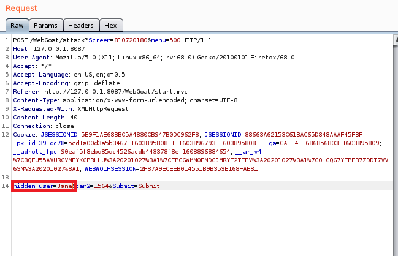

*****
###  Access Control Flaws 访问控制缺陷
**1-->Bypass Business Layer Access Control**

**实验**

* goal：作为普通员工“tom”，利用弱访问控制来使用“职员列表”页面中的“删除”功能。验证可以删除汤姆的个人资料。
* solution: 先枚举找到可以执行删除个人资料操作的帐户，观察POST，发现删除简历操作标识`action=DeleteProfile`。再以tom身份登陆，执行`viewProfile`,使用`burpsuite`对ViewProfile操作的请求进行拦截并修改，转发，即可实现tom具有删除功能。

  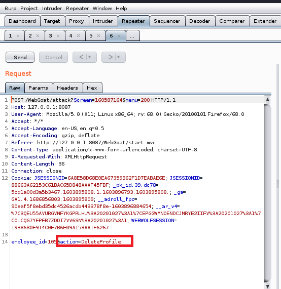
  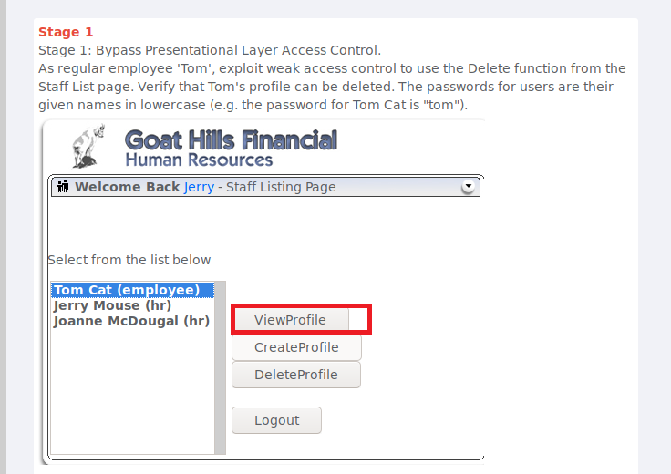

**2-->Stage 3:Breaking Data LayerAccess Control**
**实验**

* goal：作为普通员工“tom”，利用弱访问控制来查看其他员工的个人资料。
* solution: 使用burpsuite对viewprofile操作按钮进行抓包分析可知通过修改`employee_id`值便可以实现对其他人简历的访问。
* reflection: 做了多组实验，发现确实只与id值有关，普通员工tom通过修改id值可以越级访问hr,manager以及admin的简历。
 
  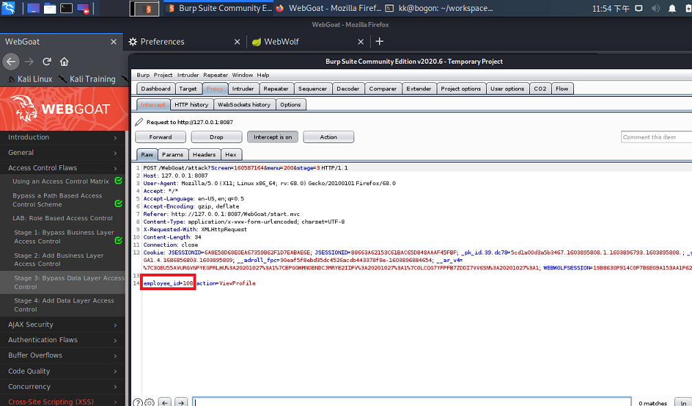
  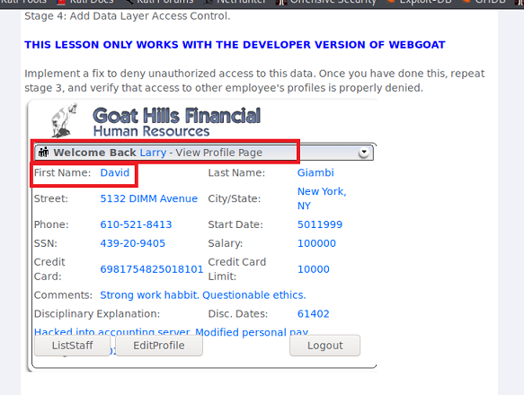

  
**防御修复**
* 页面进行严格的访问权限的控制以及对访问角色进行权限检查
* 可以使用session对用户的身份进行判断和控制

****
###  Parameter Tampering 参数修改
**1-->Bypass HTML Field Restrictions**

**实验**
* goal：实现提交表单，但提交的所有六个字段都是无效值。
* solution: 首先表单处于`disabled`状态，通过审查元素找到disabled属性，删除该node,然后sumbit.用`burpsuit`拦截该`POST`，修改所有参数的值为无效。


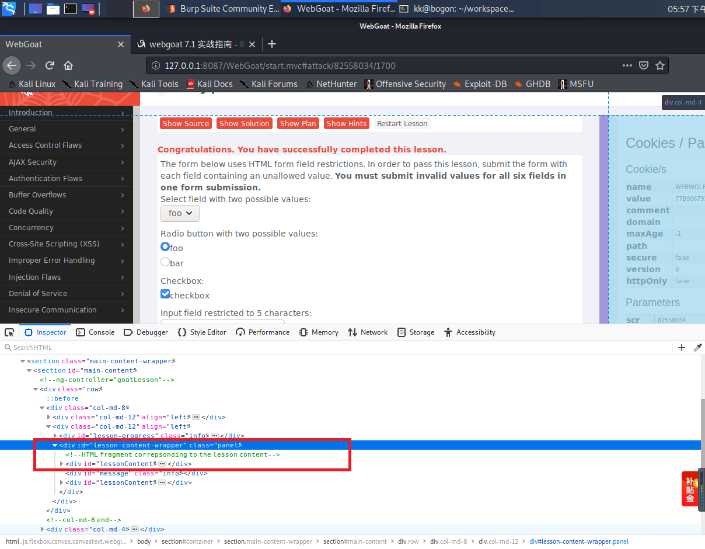
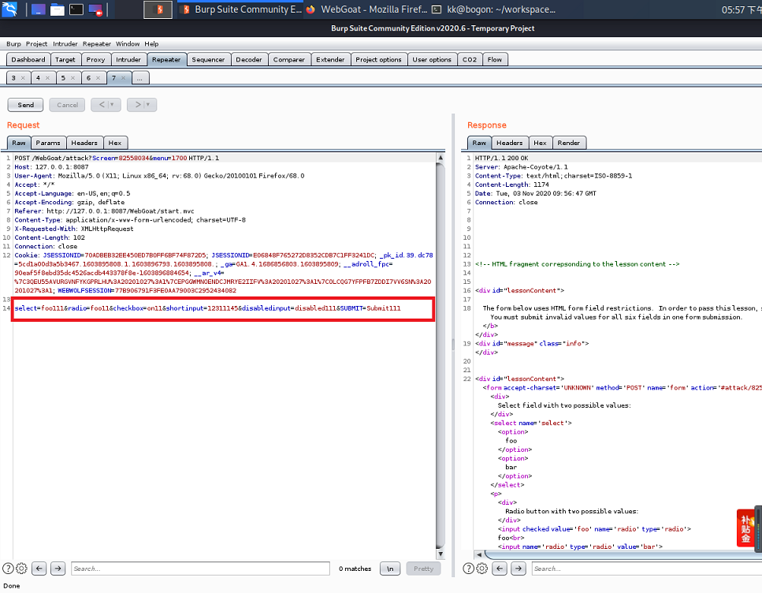

**2-->Exploit Hidden Fields**

**实验**
* goal: 修改订单的价格，尝试用更便宜的购买价格购买HDTV。
* solution: 审查HTML元素，在页面找到`“<input name="Price" type="HIDDEN" value=" 2999.9">”`，将`value`值修改为更小的值。
  
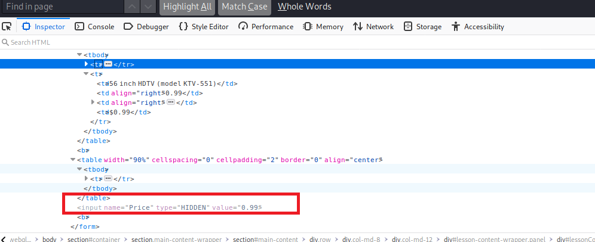

**防御修复**
* 隐藏表单字段
* 添加服务器端验证
****
###  Cross-Site Scripting XSS攻击 
**1-->Stored XSS Attacks**

**实验**
* goal: 创建非法的消息内容，可以导致其他用户访问时载入非预期的页面或内容。
* solution: 在Title里输入`“Test Stored XSS”`，在 Message里输入`<script>alert('xss')</script>`


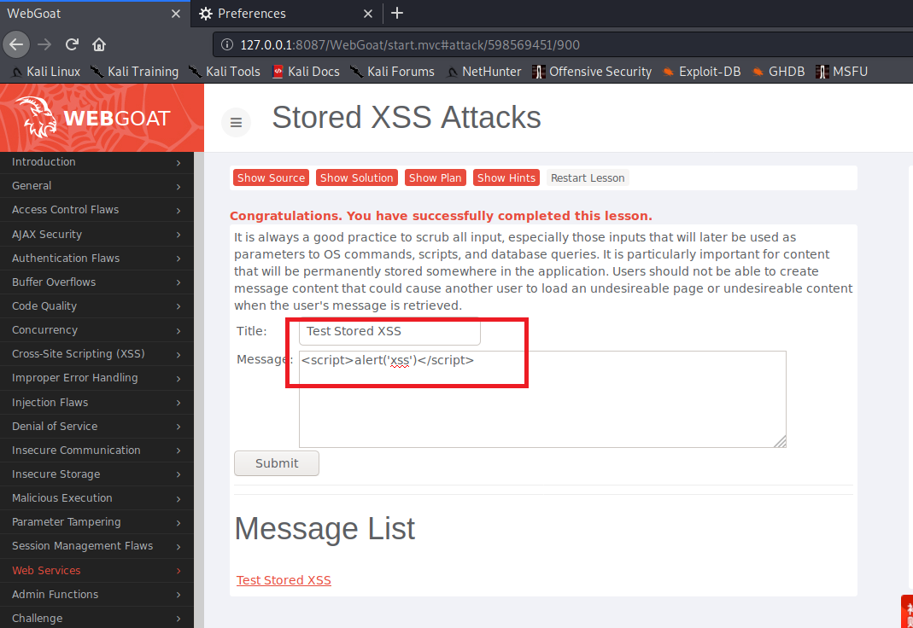
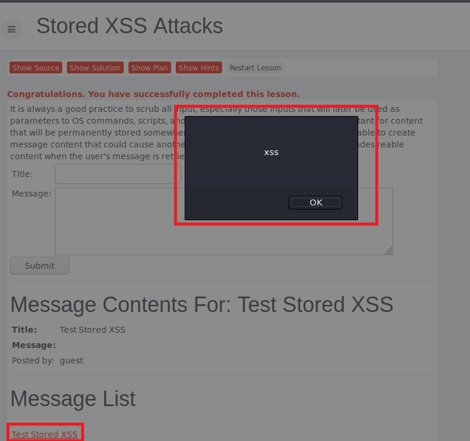

**实验**
* goal: 发送一封email。这个email包含一个image，其URL指向一个恶意请求。在这个课程中，URL应该指向“attack”servlet，其带有课程“Screen”和“menu”参数，一个额外参数“"transferFunds”带有任意数字值诸如5000
* solution: 在Title输入：`Cross Site Request Forgery Attack`，在Message输入：``
  
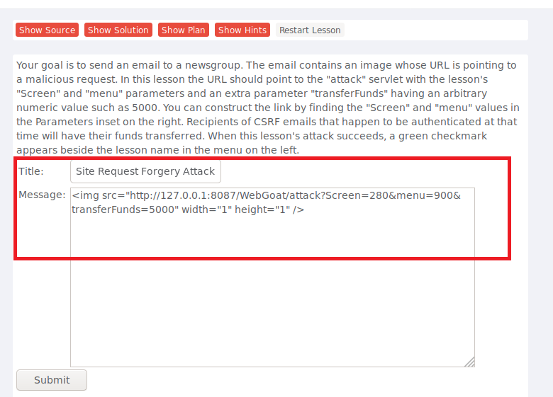
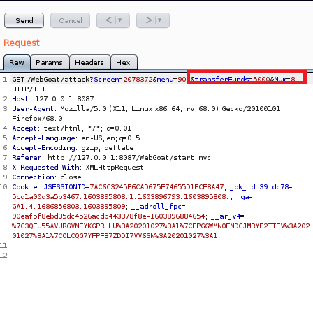
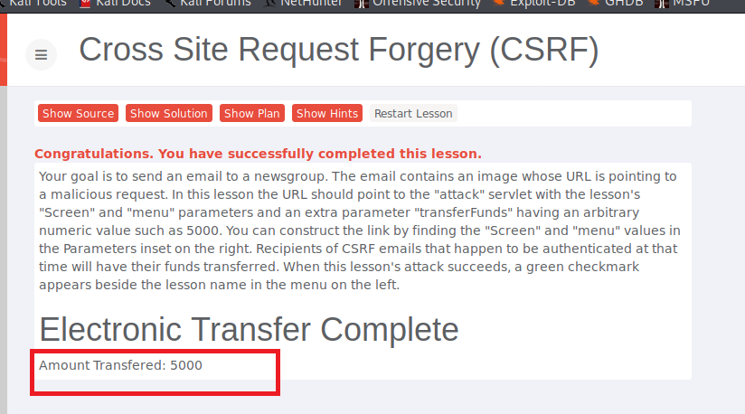

**防御修复**
* 过滤输入的数据，对例如：“ ‘ ”，“ “ ”，” < “，” > “，” on* “，script、iframe等危险字符进行严格的检查。这里的输入不仅仅是用户可以直接交互的输入接口，也包括HTTP请求中的Cookie中的变量，HTTP请求头部中的变量等。
* 对输出到页面的数据进行相应的编码转换，如HTML实体编码、JS编码等。对输出的数据也要检查，数据库里的值有可能会在一个大网站的多处都有输出，即使在输入做了编码等操作，在各处的输出点时也要进行检查。
  
****
###  Injection Flaws 注入攻击
**1-->Command Injection**

**实验**
* goal: 尝试向操作系统注入一个命令。
* solution: 通过审查元素，在HelpFile选项上加上`"&&cat "/etc/passwd`实现查看/etc/passwd内容
  
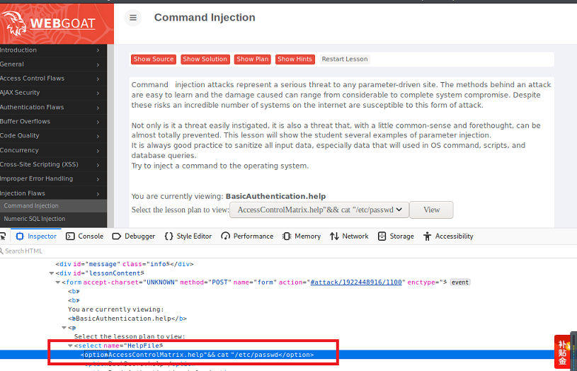
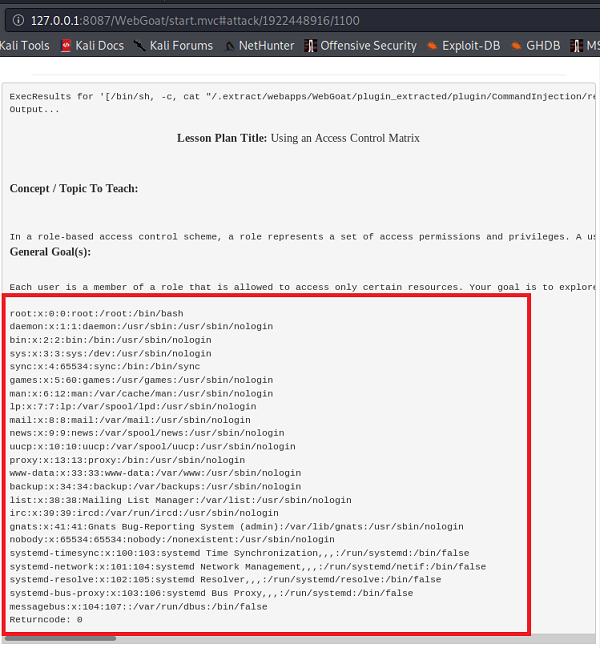

**防御修复**
* 不要设置从应用层代码调用操作系统命令
* 进行输入校验：设置白名单,验证输入只包含字母数字字符，没有其他语法或空白.


****

### Malicious Execution 恶意执行
**1-->Malicious File Exection**

**实验**
* goal: 下述表单允许你上传一个图像文件，此图像将会显示在页面上。像这样的特性通常出现在基于web的论坛和社交网站。这个特性是容易受到恶意文件执行。
为了通过这个课程，上传并运行一个恶意文件。
* solution: 将以下内容保存为hacker.jsp文件上传,并访问该.jsp上传后的url，即可使恶意代码得到执行（指定目录下新建一个txt文件）
  ```html
  <HTML><% java.io.File file = new java.io.File("/.extract/webapps/WebGoat/mfe_target/guest.txt"); file.createNewFile(); %></HTML>
  ```
* reflection：这题太坑了T——T，要求新建的txt文件位置是变化的，所以照搬网上题解的.jsp是不行的。
  
  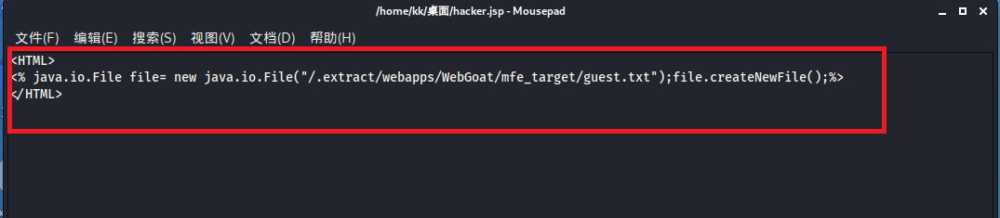
  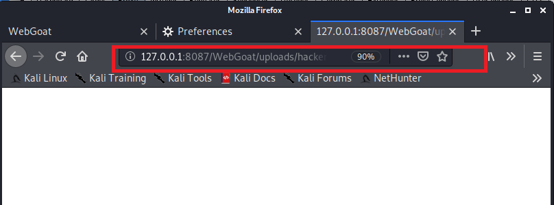
  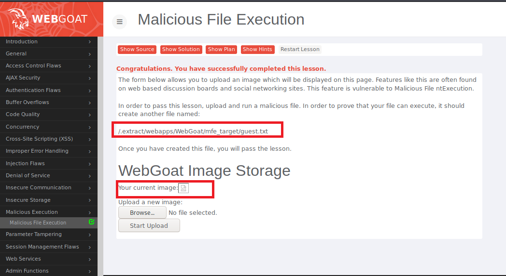

**防御修复**

* 可以通过调用HTML中的`accept`属性限制上传文件的类型，自己试了试在相应的HTML代码加了该属性，发现上传文件的类型收到了限制~
  
  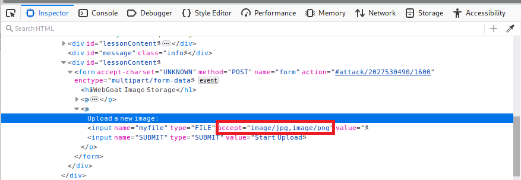
  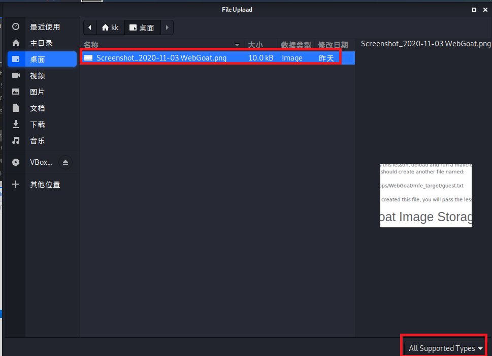
* 服务端加入`content-type`字段校验
  ```php
  <?php
        if($_FILES['userfile']['type'] != "image/gif") #这里对上传的文件类型进行判断，如果不是image/gif类型便返回错误。
                {   
                 echo "Sorry, we only allow uploading GIF images";
                 exit;
                 }
         $uploaddir = 'uploads/';
         $uploadfile = $uploaddir . basename($_FILES['userfile']['name']);
         if (move_uploaded_file($_FILES['userfile']['tmp_name'], $uploadfile))
             {
                 echo "File is valid, and was successfully uploaded.\n";
                } else {
                     echo "File uploading failed.\n";
    }
    ?>
* 严格限制上传的文件路径
* 严格限制和校验上传的文件，禁止上传恶意代码的文件。同时限制相关上传文件目录的执行权限，防止木马执行

## 遇到的问题
* Firefox和burpsuite设置好代理后，burpsuit无法抓取本地包？

解决：手动搜索原因，在csdn[一篇博客](https://blog.csdn.net/weixin_45396639/article/details/104379312?utm_source=app)上看到可能是因为系统设置为不抓取本地包，按照博客在访问`about:config`后,在搜索框内搜索 `network.proxy.allow_hijacking_localhost`，将值改为`true`,问题解决！


## 参考资料

[ 往届作业 ](https://github.com/CUCCS/2019-NS-Public-hejueyun/pull/4/commits/b207619d5d45b811794bf8f327dce612e09d89ff?short_path=b335630#diff-b335630551682c19a781afebcf4d07bf978fb1f8ac04c6bf87428ed5106870f5 )

[ 线上课本 ](https://c4pr1c3.gitee.io/cuc-ns/chap0x05/main.html)

[ WebGoat教程 ](https://www.cnblogs.com/wuweidong/p/8677431.html)

[Web常见漏洞描述及修复建议](https://www.cnblogs.com/iAmSoScArEd/p/10651947.html#auto_id_1)