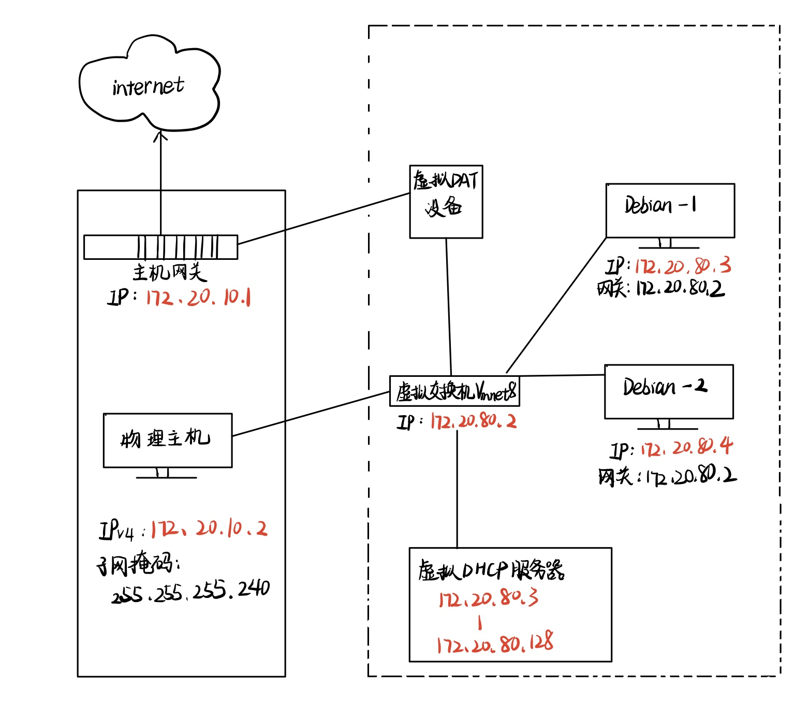
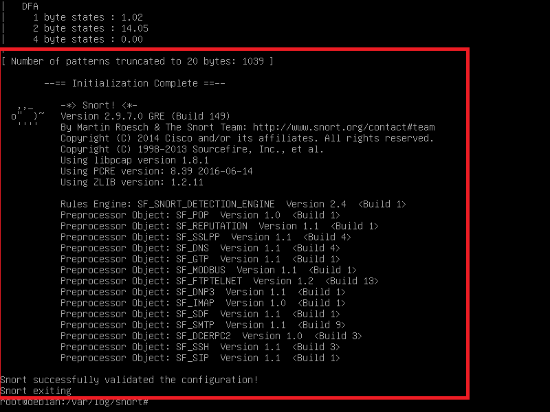
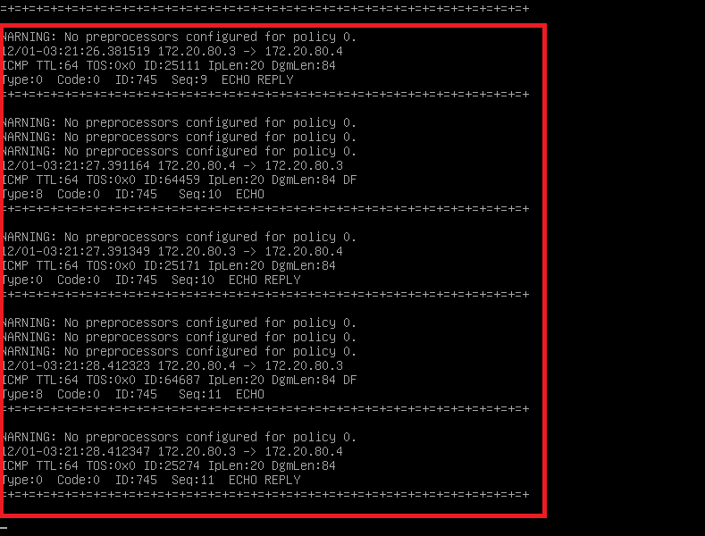
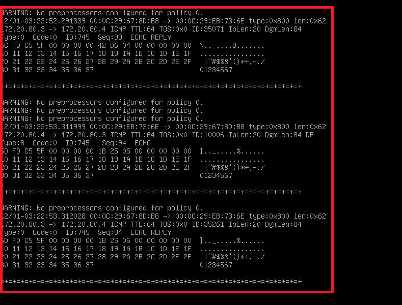
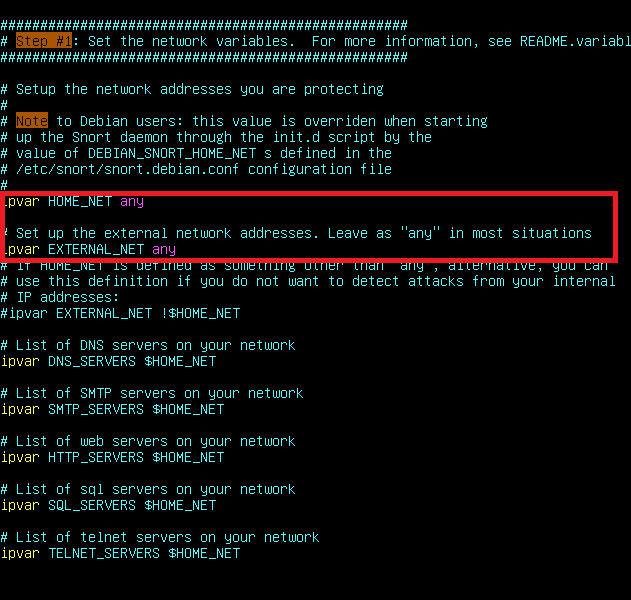
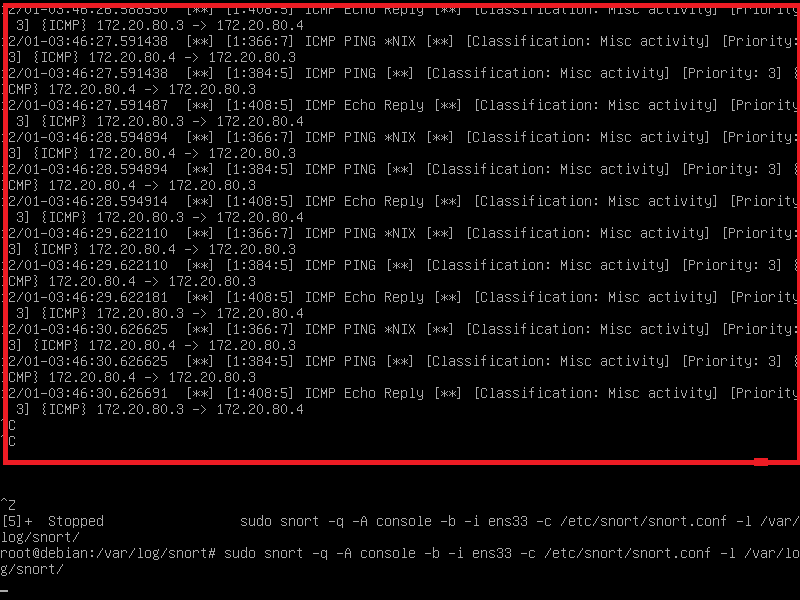
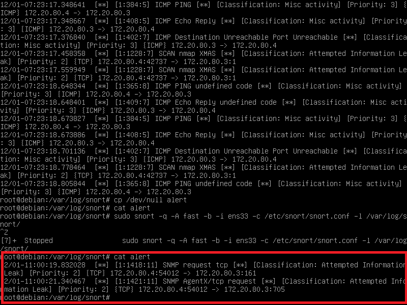
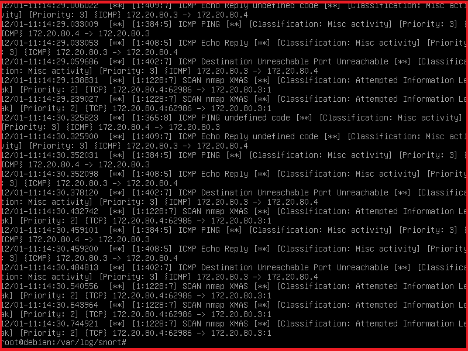
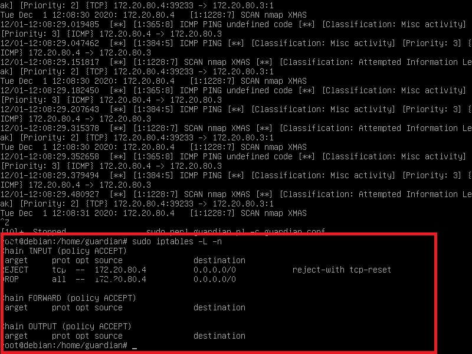

## 实验九 Snort入侵检测

### 实验目的
+ 了解入侵检测的基本原理与实现方法

### 实验环境

* 拓扑图：
 
* 两台网络设置为NAT模式的Debian，可互通可连外网，启用ens33网卡。
  
 | Machine | IP | 
 | ---- | ---- |
  | Debain-1 | 172.20.80.3/24
 | Debain-2 | 172.20.80.4/24
  | 物理主机 | 172.20.10.2
  | 主机网关 | 172.20.10.1
* 虚拟机平台：VMware
* 软件:Snort

### 实验准备
**在Debian-1上安装Snort**
+ 禁止在apt安装时弹出交互式配置界面

	` export DEBIAN_FRONTEND=noninteractive  `

+ 安装snort

	` apt install snort `

+ 开启测试模式测试snort配置

	` snort -T -c /etc/snort/snort.conf `

 

**了解Snort基本指令参数**
+ -q    安静模式，不显示标志和状态报告。
+ -D    精灵模式，转为后台运行。
+ -v    从网络上读出数据包然后显示在控制台上。
+ -b    用二进制文件保存网络数据包，以应付高吞吐量的网络。
+ -i < if > 设置网络接口为< if >。可以用-W选项查询网络接口列表，然后用接口序号index指定接口。
+ -A < alert >     设置报警模式。
+ -c < cf >   使用配置文件< cf >，这会使得snort进入IDS模式，并从<cf>中读取运行的配置信息。
+ -l < ld >   设置数据包文件存放目录< ld >。默认目录是/var/log/snort。

### 实验过程

####  实验一：配置snort为嗅探模式

+ 显示IP/TCP/UDP/ICMP头

	`snort –v `

 
    
+ 显示应用层数据

	`snort –vd `

 
    
+  显示数据链路层报文头

	`snort –vde `

 
  
*说明：输入指令期间，Debian-2在不断地 ping Debian-1*

#### 实验二：配置并启用snort内置规则 
+ 正确定义HOME_NET 和 EXTERNAL_NET，处于学习与实验目的将之设为any

	`vim /etc/snort/snort.conf `
+  启用snort内置规则

	`snort -q -A console -b -i ens33 -c /etc/snort/snort.conf -l /var/log/snort/ `

 

 

#### 实验三：自定义snort规则
+ 新建自定义 snort 规则文件

	`cat << EOF > /etc/snort/rules/cnss.rules`
    
	`alert tcp \$EXTERNAL_NET any -> \$HTTP_SERVERS 80 (msg:"Access Violation has been detected on /etc/passwd ";flags: A+; content:"/etc/passwd"; nocase;sid:1000001; rev:1;)`

	`alert tcp \$EXTERNAL_NET any -> \$HTTP_SERVERS 80 (msg:"Possible too many connections toward my http server"; threshold:type threshold, track by_src, count 100, seconds 2; classtype:attempted-dos; sid:1000002; rev:1;)`
    

	`EOF`
+  添加配置代码到 /etc/snort/snort.conf

	`include $RULE_PATH/cnss.rules `
+  endian-2 对 endian-1 的进行端口扫描 'nmap 172.20.80.3',endian-1的检测日志中出现如下内容:

 

#### 实验四：和防火墙联动
* Debain-1下载 Guardian-1.7.tar.gz 并解压
	
	`curl -o guardian.tar.gz https://c4pr1c3.github.io/cuc-ns/chap0x09/attach/guardian.tar.gz`
	
	`tar zxf guardian.tar.gz -C /home`
* 安装 Guardian 的依赖 lib
	
	`apt install libperl4-corelibs-perl`
* 切换至guardian的目录/home/guardian,编辑 guardian.conf 并保存，确认以下2个参数的配置符合主机的实际环境参数。

	`HostIpAddr      172.20.80.3`

	`Interface       ens33`
	
**开启Snort**
`snort -D -q -A fast -b -i ens33 -c /etc/snort/snort.conf -l /var/log/snort/`

**开启 guardian.pl**
`perl guardian.pl -c guardian.conf`
* Debian-2用 nmap 暴力扫描 Debian-1:

	`nmap 172.20.80.3 -A -T4 -n -vv`
* endian-1的检测日志中出现如下内容:

* 执行 iptables -L -n 查看联动效果

### 遇到的问题
* **Kali无法简便安装Snort?**
  
	解决：曲线救实验————用Debian！
* **snort与guardian无法先后同时开启导致无法联动iptables?**
	
	解决：加上-D参数，使snort处于精灵模式（好可爱的名称），即可双开Snort和guardian.

### 实验参考

[ 实验指导 ](https://c4pr1c3.gitee.io/cuc-ns/chap0x05/main.html)

[ 往届作业 ](https://github.com/CUCCS/2019-NS-Public-hejueyun/tree/chap0x09/chap0x09)

[ Snort简介 ](https://blog.csdn.net/cookieXSS/article/details/106529112)