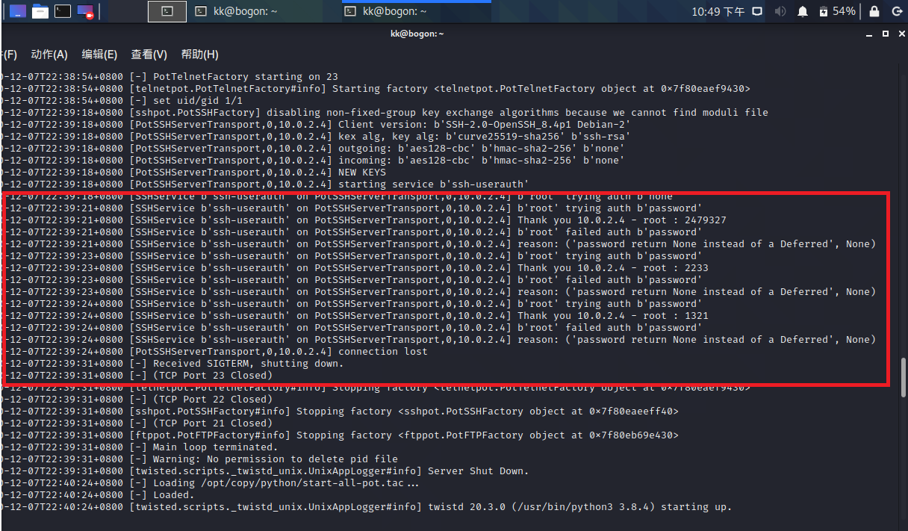

## 实验十一 常见蜜罐体验和探索

### 实验目的
+ 了解蜜罐的分类和基本原理
+ 了解不同类型蜜罐的适用场合
+ 掌握常见蜜罐的搭建和使用

### 实验环境

* 拓扑图：
  
	

* 两台网络设置为NAT模式的KALI，可互通可连外网。
  
  | Machine | IP | 
  | ---- | ---- |
  | V-KALI | 10.0.2.15
  | A-KALI | 10.0.2.4

* 虚拟机平台：VirtualBox
* 蜜罐选择：twisted-honeypots(低交互),cowrie(中等交互)

### 实验准备
**低交互型蜜罐**
```
A low interaction honeypot will only give an attacker very limited access to the operating system. ‘Low interaction’ means exactly that, the adversary will not be able to interact with your decoy system in any depth, as it is a much more static environment
```
**中交互型蜜罐**
```
A medium interaction honeypot strategy is the best balance, providing less risk than creating a complete physical or virtualized system to divert attackers, but with more functionality. These would still not be suitable for complex threats such as zero day exploits, but could target attackers looking for specific vulnerabilities.
```
**在V-KALI上安装twisted-honeypots**

` git clone https://github.com/lanjelot/twisted-honeypots /opt/copy`

` cd /opt/copy`

`service mysql start`

` sudo ./install.sh && ./setup-db.sh`

*安装过程中系统会提醒需要为`twist`添加环境变量，具体命令注意看提示，我的添加命令为：`export PATH="/root/.local/bin:$PATH"`(此命令仅临时有效，每次重开终端都需要执行一次)*

**在V-KALI上安装cowrie**

`git clone https://github.com/cowrie/docker-cowrie.git /var/log`

`cd /var/log/docker-cowrie/`

`docker pull cowrie/cowrie`


### 实验过程

####  实验一：twisted-honeypots
+ 进入/opt/copy目录下,开启/关闭服务命令

	`./start.sh`

	`./stop.sh`
 

+ 查看监控运行界面

	`./monitor.sh`

	 


+ 在A-KALI上执行：`ssh kk@10.0.2.15`，`ssh root@10.0.2.15`
 
	==> 无论密码正确与否都无法远程登陆，蜜罐的界面如下

	 

+ 读了读`setup-db.sh` ,`vars.sh`得知对应日志的路径为：/var/log/twistd-pot.log,就进去翻了翻= =
	
     

* **nmap扫描**
	
	`sudo nmap -sN -P 22 -n vv 10.0.2.15`

	`sudo nmap -sX -P 22 -n -vv  10.0.2.15`

	`sudo nmap -sT -P 22 -n -vv 10.0.2.15`

	==> 监控界面和日志没有相关的端口扫描记录

	 

	

#### 实验二：cowrie 

+ 进入安装目录/var/log/docker-cowrie(你猜为什么是这个路径~上次看日志忘记退回家目录了= =)，开启cowrie服务：
	
	`docker run -p 2222:2222 cowrie/cowrie`
+  在A-KALI上执行：
   
+  `ssh -p 2222 kk@10.0.2.15`
   
+  `ssh -p 2222 root@10.0.2.15`
 
	==> root用户可以以任意密码登陆成功，而非root用户任何密码都无法登陆成功，登陆信息如下：
    
     
    
+ root远程登陆成功后，运行多种指令判断是否是进入了蜜罐
  
	+ ping [   ]
	==> 无论ping什么都能通，就很离谱~~
	

    + apt-get update/upgrade
    ==> pemission denied报错,但现在可是root啊(忘记截图了Q^Q)！！
    + echo $PATH
    
    ==> 无异于echo 'this is a honeypot'~
	+ [  ]
    ==> 执行命令期间，会突然断开连接...
    
    
### 如何辨别当前目标是一个「蜜罐」？
* 从自己的这次实验来说，有环境不真实导致穿帮的情况，如apt和ping的行为异常。其他辨别方法，[大佬都在推的好文](https://www.zhihu.com/question/31213254/answer/137153019)总结的挺好的啦！~~我们不生产知识，我们只是知识的搬运工~~

### 遇到的问题

* **第一次运行twistd-honeypotd 和cowrie没有任何反应?**

	解决：网络模式不对，不是网络地址转换（NAT),而是NatNetwork!


### 实验参考

[ 实验指导 ](https://c4pr1c3.github.io/cuc-ns/chap0x11/exp.html)

[ 往届作业 ](https://github.com/CUCCS/2019-NS-Public-hejueyun/tree/chap0x011/chap0x011)

[ honeypot ](https://www.guardicore.com/2019/1/high-interaction-honeypot-versus-low-interaction-honeypot/)